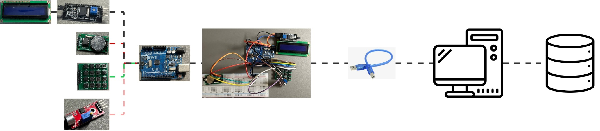
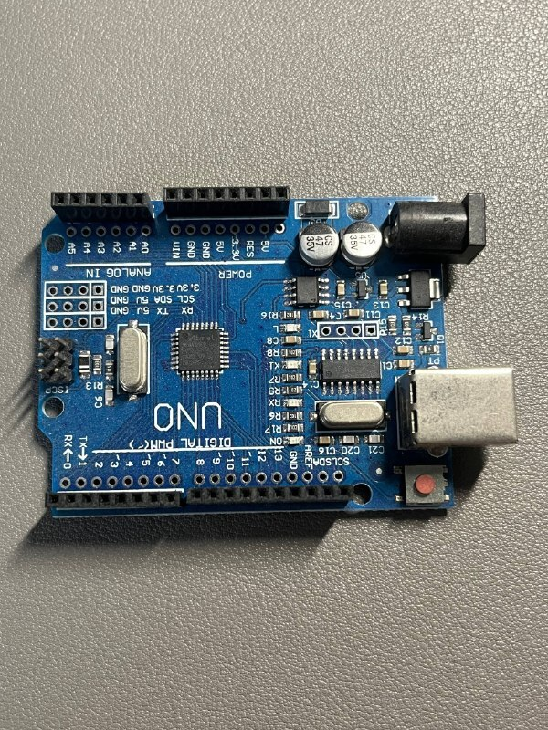
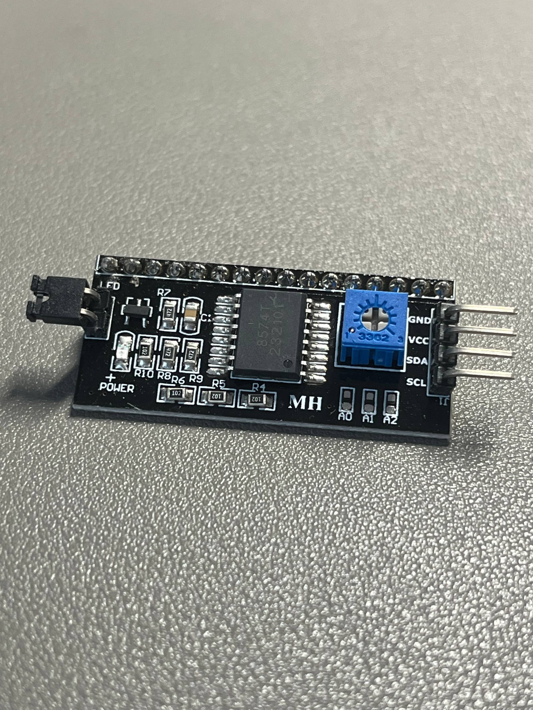
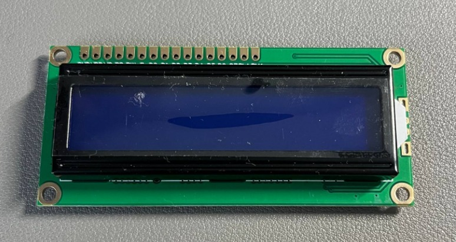
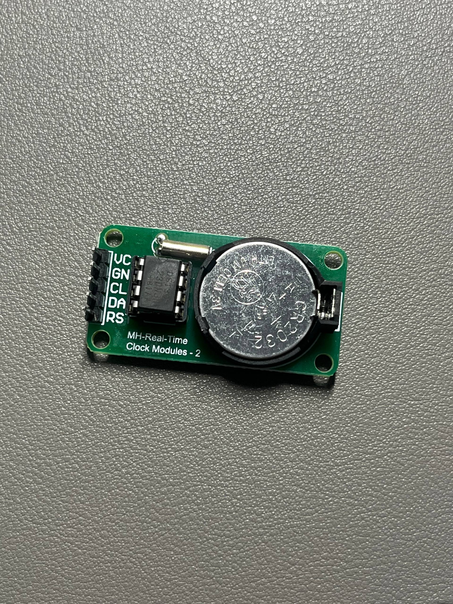
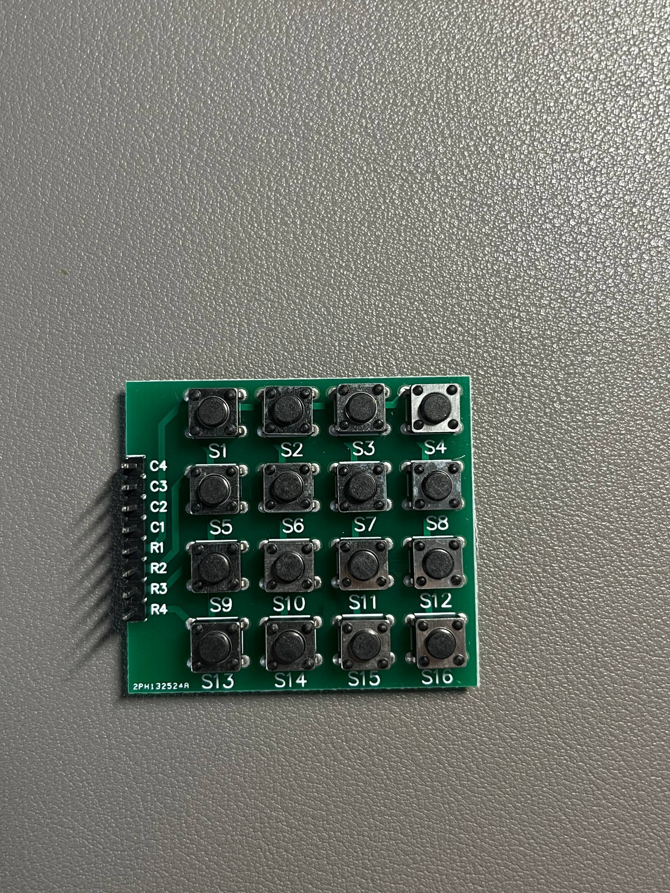
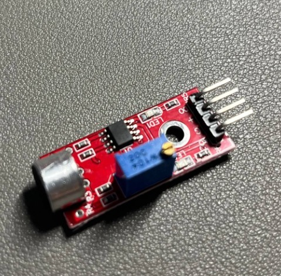
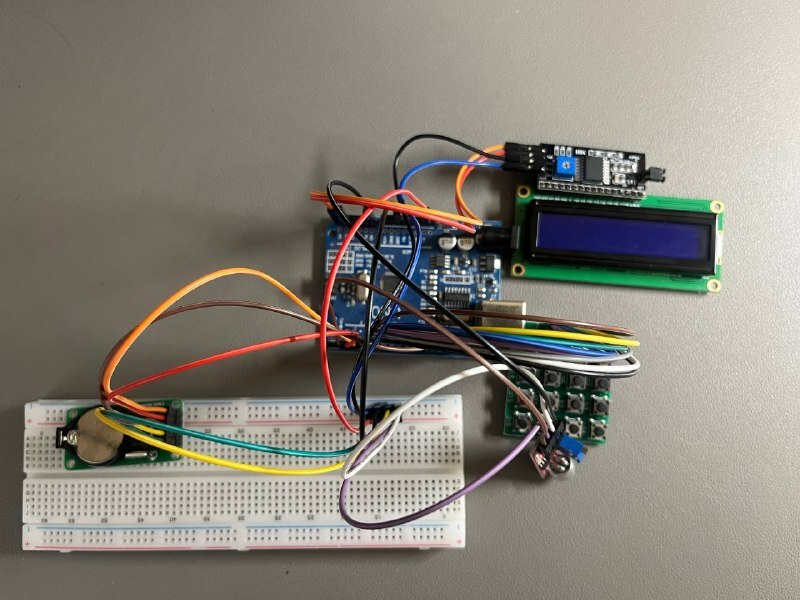

  

## Подключение компонентов
### Arduino Uno

| Компонент              | Пин на модуле | Пин на Arduino |
|------------------------|---------------|----------------|
| **LCD + I2C-адаптер**  | VCC           | 5V             |
|                        | GND           | GND            |
|                        | SDA           | A4             |
|                        | SCL           | A5             |
| **RTC DS1302**         | VCC           | 5V             |
|                        | GND           | GND            |
|                        | RST           | D4             |
|                        | DAT           | D3             |
|                        | CLK           | D13            |
| **Клавиатура 4×4**     | R1            | D12            |
|                        | R2            | D11            |
|                        | R3            | D10            |
|                        | R4            | D9             |
|                        | C1            | D8             |
|                        | C2            | D7             |
|                        | C3            | D6             |
|                        | C4            | D5             |
| **Датчик звука**       | VCC / +       | 5V             |
|                        | GND           | GND            |
|                        | AO            | A0             |
|                        | DO            | D2 (опционально) |

---

### LCD 1602 + I2C-адаптер

### RTC DS1302 (MH-Real-Time Clock Modules-2)

### Матричная клавиатура 4×4

### Датчик звука

---

### Общая схема подключения

